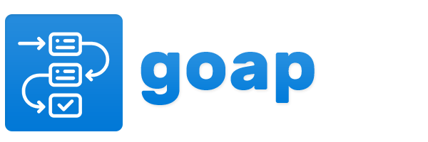

 

## GOAP: Goal-Oriented Action Planning in Go

**GOAP** is a Goal-Oriented Action Planning library written in Go. It is designed to help you find plans to achieve a specific goal by selecting appropriate actions from a set of available actions. GOAP is well-suited for solving complex decision-making problems, such as AI planning in games, robotics, and other applications.

### Features

1. **High Performance**: This library is designed for efficiency and performance, making it suitable for real-time applications.

2. **Flexible Actions**: Define custom actions that can be used in the planning process.

3. **Numeric and Symbolic States**: The library supports both numeric and symbolic states, making it versatile for various types of problems

4. **Heuristic Search**: The library uses heuristic search (A\*) to efficiently explore possible plans.

## License

This library is licensed under the MIT license. See the [LICENSE](https://github.com/kelindar/goap/LICENSE) file in the project root for more details.

## Credits

This library is developed and maintained by [Roman Atachiants](https://github.com/kelindar) and contributions from the open-source community. We welcome contributions and feedback to make the library even better.
